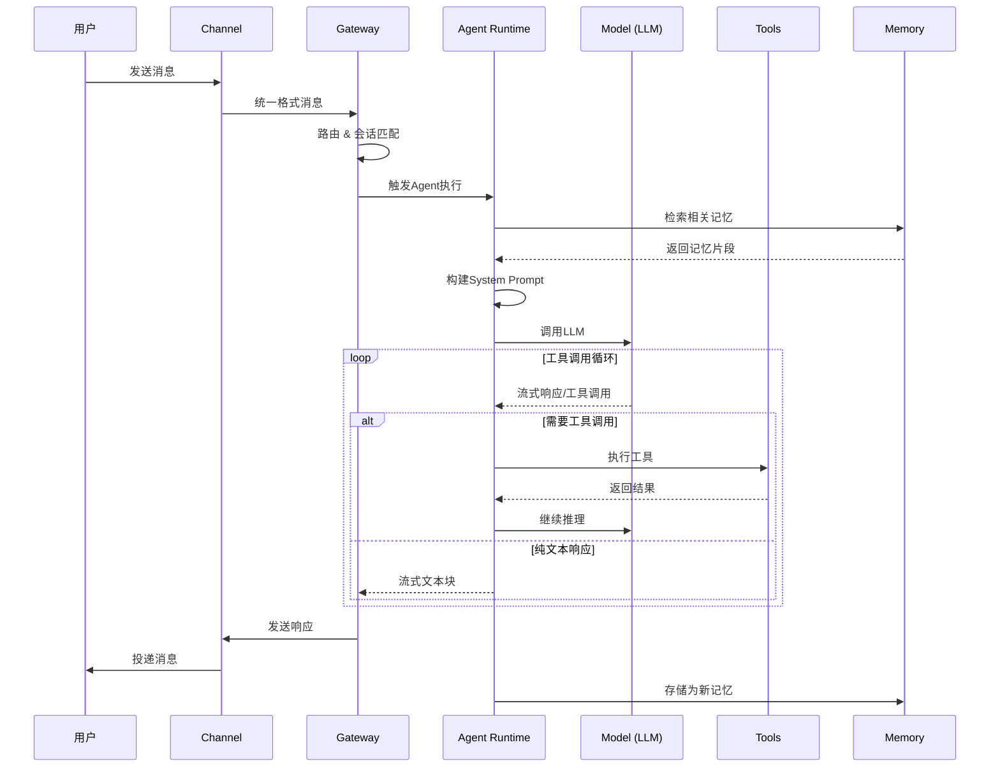
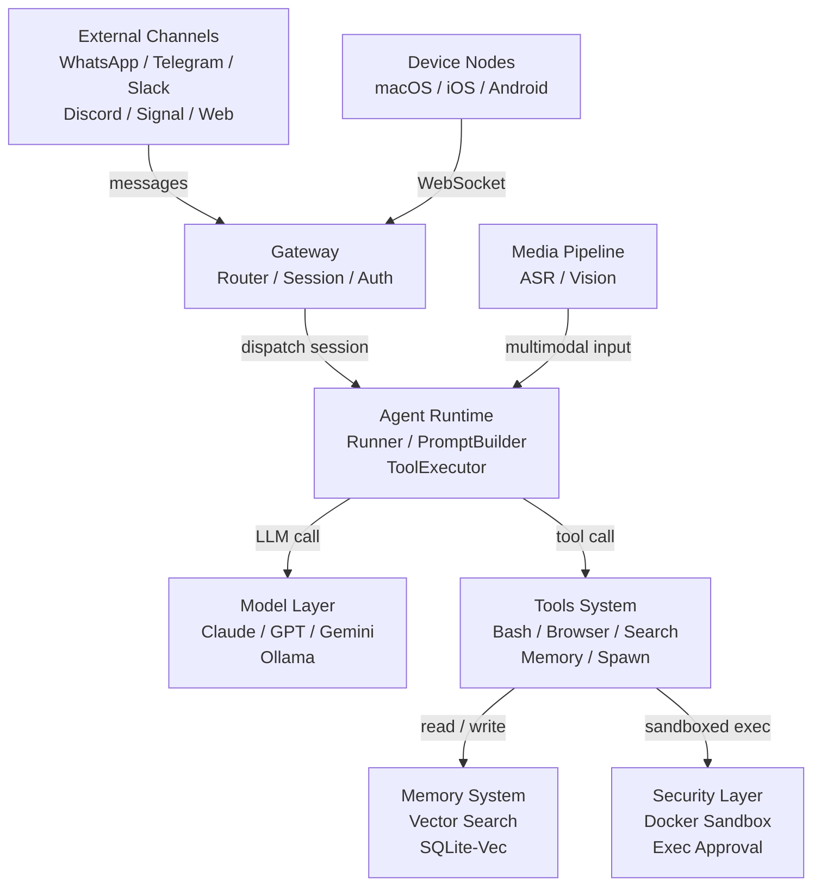

# 核心模块 

我们在做一个抽象，他的时序图如下：

可以看到，整个流程中最神秘的地方仍然是 `ReAct`，即 `Reason + Action`。即在完成一项任务的时候，先思考任务如何完成，再行动（调用工具），往复循环，直到不用再进行工具调用的时候，任务也就完成了。

当然，除了这个核心，龙虾还实现了其他的核心模块：

# 龙虾 Agent 架构 · 核心子系统说明

> 本文档对 龙虾 Agent 整体架构中的 7 个核心子系统逐一进行功能说明，对应上图中的各节点。

---

## 1. External Channels · 外部消息渠道

**定位**：系统的最外层入口，负责与终端用户的实际通讯。

龙虾 Agent 支持 7 种主流即时通讯平台的接入：WhatsApp、Telegram、Slack、Discord、Signal、iMessage 以及内置的 WebChat。每种平台都有其独立的消息格式、鉴权机制和推送协议，Channel Layer（渠道适配层）负责将这些差异屏蔽掉，将所有外部消息统一归一化为系统内部格式，再向上传递给 Gateway。

此外，平台工具（Platform Action Tools）提供反向通道，允许 Agent 主动向各平台发送消息、修改频道状态等，实现双向交互。

---

## 2. Gateway · 控制平面

**定位**：系统的神经中枢，监听 `ws://127.0.0.1:18789`，所有消息和控制指令的汇聚点。

Gateway 承担着整个系统的调度与治理职责，内部包含以下核心组件：

- **Router（路由引擎）**：接收来自所有渠道适配器和设备节点的消息，根据规则决定消息的流向，同时负责将含多模态内容的消息分发给媒体管道预处理。
- **Session Manager（会话管理器）**：管理 Agent 会话的完整生命周期，包括创建、挂起、恢复和销毁。每条消息最终都通过 Session Manager 触发或唤醒一个 Agent 运行时实例。
- **Config Manager（配置管理器）**：统一管理系统配置，向 Router、Session Manager、Plugin Manager 下发运行时参数，是配置变更的唯一入口。
- **Plugin Manager（插件管理器）**：负责插件的注册、加载和生命周期管理，与 Hook Engine 协作实现插件扩展点。
- **Hook Engine（钩子引擎）**：提供事件驱动的扩展机制，允许插件在会话的关键节点（如消息接收、工具调用前后）插入自定义逻辑。
- **Cron Scheduler（定时调度器）**：支持基于时间规则的任务调度，可定时触发 Session Manager 发起新的 Agent 会话，实现无需用户主动发起的计划任务。
- **Auth Manager（认证管理器）**：负责用户和渠道的身份验证与权限校验，在会话创建前完成鉴权，确保只有合法请求才能进入系统。

---

## 3. Agent Runtime · Agent 运行时

**定位**：Agent 智能行为的执行核心，驱动从"接收任务"到"完成任务"的完整推理循环。

Agent Runtime 以 Pi Embedded Runner 为主循环，接收 Session Manager 的调度指令后开始工作：

- **Pi Embedded Runner（执行器）**：主推理循环，负责编排整个 Agent 的工作流，协调提示词构建、模型调用、工具执行和上下文管理。
- **System Prompt Builder（提示词构建器）**：在每轮推理开始前，动态组装系统提示词。它会从 Skills System 加载当前激活的技能指令，将技能定义、用户偏好、工具描述等内容合并为完整的系统提示词传给模型。
- **Pi Embedded Subscriber（流式订阅器）**：以流式方式监听模型的输出，实时处理每个 token。当检测到 `tool_use` 事件时，立即将工具调用请求转发给 Tool Executor 处理，无需等待完整响应。
- **Tool Executor（工具执行调度器）**：接收模型发起的工具调用，并行或串行地分发给对应的工具实现，收集 `tool_result` 后将结果注入下一轮推理上下文。
- **Context Compactor（上下文压缩器）**：监控当前会话的上下文长度，当接近模型的 token 上限时，自动对历史消息进行摘要和压缩，在保留关键信息的同时为新内容腾出空间，保证长会话的持续运行。

---

## 4. Model Layer · 模型层

**定位**：屏蔽多 LLM Provider 差异的统一模型调用层，提供智能路由和高可用保障。

模型层使 Agent Runtime 无需感知具体使用的是哪家模型服务，内部由三个组件协作完成：

- **Model Selector（模型选择器）**：根据当前任务类型、系统配置和用户偏好，从可用的 Provider 列表中选择最合适的模型。
- **Failover Engine（故障转移引擎）**：当选定的 Provider 出现调用失败、超时或限流时，自动切换到备用 Provider，确保服务连续性，对上层 Runner 透明。
- **Auth Profiles（认证配置）**：集中管理各 Provider 的 API Key、访问凭证和账户配置，统一注入到实际的 API 请求中。

目前支持的 LLM Provider 包括：**Anthropic Claude**、**OpenAI GPT**、**Google Gemini**、**AWS Bedrock** 以及本地部署的 **Ollama** 兼容模型。

---

## 5. Tools System · 工具系统

**定位**：Agent 感知世界、执行动作的能力集合，是 Agent 从"对话"走向"行动"的关键。

工具系统按功能分为四个类别：

- **核心工具（Core Tools）**：提供直接操作计算机的能力。Bash 工具允许执行 Shell 命令，Browser 工具实现无头浏览器控制，Canvas 工具用于生成可视化内容。这类工具的执行均经过安全层的沙箱隔离。
- **信息工具（Info Tools）**：提供信息获取能力。Web Search 工具调用搜索引擎获取实时信息，Web Fetch 工具抓取并解析指定网页，Memory Tool 从记忆系统中检索历史知识和上下文。
- **Agent 协作工具（Agent Collaboration Tools）**：支持多 Agent 架构。Sessions Send 允许向其他已有会话发送消息，Sessions Spawn 可以动态创建子 Agent 并将子任务委托给它处理，实现并行和层级化的 Agent 协作。
- **平台动作工具（Platform Action Tools）**：提供对各 IM 平台的主动操作能力，如 Discord Actions、Telegram Actions、Slack Actions，允许 Agent 在对话之外主动推送消息、管理频道等。

---

## 6. Memory System · 记忆系统

**定位**：为 Agent 提供跨会话的长期记忆能力，弥补 LLM 上下文窗口有限的天然缺陷。

记忆系统以 SQLite-Vec 作为底层向量数据库，通过 Memory Manager 统一对外提供读写接口：

- **写入流程**：当 Agent 需要记住某条信息时，Memory Manager 将内容交给 Embedding Generator，生成对应的语义向量后，连同原始文本一起持久化存入 SQLite-Vec。
- **检索流程**：当 Agent 查询记忆时，Hybrid Search 引擎同时进行语义向量检索和关键词匹配两种方式，将两路结果融合排序后返回最相关的记忆条目，兼顾语义理解和精确匹配。

这套混合检索机制使 Agent 既能理解"意思相近但表述不同"的查询，也能精确定位包含特定关键词的记忆。

---

## 7. Security Layer & Media Pipeline · 安全层与媒体管道

**定位**：安全层保障工具执行的安全边界，媒体管道将多模态内容转化为 Agent 可处理的结构化信息。

**安全层**通过三道机制保护系统：

- **Exec Approval（执行审批）**：对高风险工具调用（如 Bash 命令、文件写入）进行拦截，在执行前要求额外的人工确认或策略审核，防止 Agent 误操作。
- **Sandbox（Docker 沙箱）**：Bash 和 Browser 等核心工具在隔离的 Docker 容器中运行，即使执行的代码存在恶意行为，也无法影响宿主系统。
- **Tool Policy（工具策略）**：定义每个工具的细粒度权限规则，如允许访问的网络范围、文件系统路径等，沙箱执行时读取策略进行合规约束。

**媒体管道**在消息进入 Agent Runtime 之前完成多模态内容的预处理：

- **Vision Model**：接收图片、截图等图像输入，提取语义描述和结构化内容，转换为文本形式供 LLM 理解。
- **ASR（Whisper）**：接收音频或语音消息，通过 Whisper 模型转写为文本，使 Agent 具备理解语音输入的能力。

---

## 子系统关系速查

| 子系统               | 上游                    | 下游                                    |
| ----------------- | --------------------- | ------------------------------------- |
| External Channels | 用户                    | Gateway                               |
| Gateway           | Channels、Device Nodes | Agent Runtime、Media Pipeline          |
| Agent Runtime     | Gateway               | Model Layer、Tools System              |
| Model Layer       | Agent Runtime         | LLM Providers                         |
| Tools System      | Agent Runtime         | Memory System、Security Layer、Channels |
| Memory System     | Tools System          | —                                     |
| Security Layer    | Tools System          | —                                     |
| Media Pipeline    | Gateway               | Agent Runtime                         |
