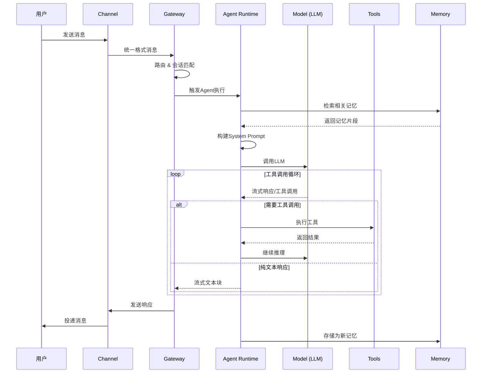
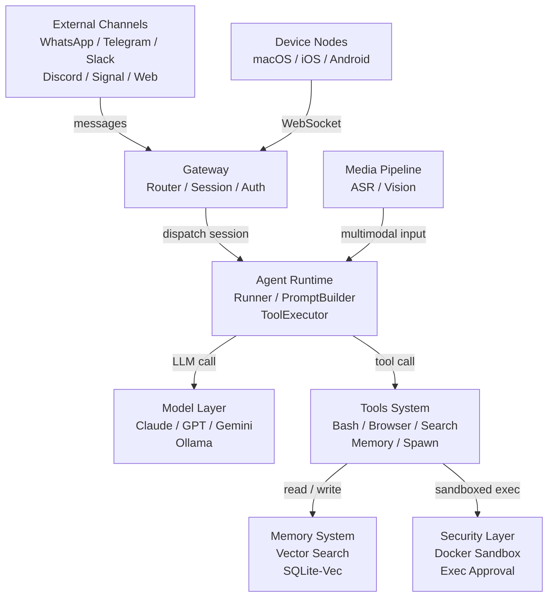

# 一文拆透：龙虾 Agent 的 7 大核心子系统

大家好，我是算法工程笔记。

上一篇文章，[一个任务流，看懂爆火的“龙虾 Agent”到底怎么干活](https://mp.weixin.qq.com/s/Ffui6VFn768eyoNTp0_pJw)，通过一个典型任务简要地分析了龙虾 Agent的执行流程。

今天我们再深入一下，聊聊龙虾 Agent 的整体架构和 7 个核心子系统，帮大家建立一个清晰的全景认知。

---

## 先看全局：一条消息的完整旅程

在拆解各个子系统之前，先用一张时序图看看，当用户发出一条消息后，系统内部到底发生了什么：

整个流程中最精髓的部分，就是中间那个循环——**ReAct（Reason + Action）**。

> 一句话概括：Agent 先想清楚该干什么，再动手调工具去干，干完再想下一步——周而复始，直到任务完成。

这就是 Agent 区别于普通聊天机器人的本质所在。

当然，光有 ReAct 还远远不够。要让一个 Agent 真正"跑起来"，背后还需要一套完整的基础设施。来看龙虾的 7 大核心子系统：

下面逐一拆解。

---

## 1. External Channels · 外部消息渠道

**一句话定位**：系统最外层的"门面"，负责对接用户所在的各类 IM 平台。

龙虾目前支持 **7 种**主流通讯平台接入：WhatsApp、Telegram、Slack、Discord、Signal、iMessage，以及内置的 WebChat。

每个平台的消息格式、鉴权方式、推送协议都不一样——光是 Telegram 的 Markdown 和 Discord 的 Markdown 就是两套语法。**Channel Layer（渠道适配层）**干的就是把这些差异吃掉，统一归一化成系统内部格式，再往上抛给 Gateway。

> 类比一下：Channel 就像一个多语种的前台接待员，不管客人说英语、日语还是法语，她都能翻译成普通话交给后面的同事。

此外，**平台动作工具（Platform Action Tools）**还提供了反向通道——Agent 不只是被动回复，还能主动往各平台推送消息、管理频道状态，实现真正的双向交互。

---

## 2. Gateway · 控制平面

**一句话定位**：整个系统的"神经中枢"，所有消息和控制指令的汇聚点。

Gateway 监听 `ws://127.0.0.1:18789`，内部塞了不少东西：

* **Router（路由引擎）**——接收所有渠道和设备节点的消息，决定消息该往哪走。遇到图片、音频等多模态内容，还会分发给媒体管道预处理。
* **Session Manager（会话管理器）**——管理 Agent 会话的完整生命周期：创建、挂起、恢复、销毁。每条消息最终都通过它来触发或唤醒一个 Agent 运行时实例。
* **Config Manager（配置管理器）**——配置变更的唯一入口，统一向其他组件下发运行时参数。
* **Plugin Manager（插件管理器）**——负责插件的注册、加载和生命周期管理。
* **Hook Engine（钩子引擎）**——事件驱动的扩展点，允许插件在消息接收、工具调用前后等关键节点插入自定义逻辑。
* **Cron Scheduler（定时调度器）**——支持定时任务，可以不需要用户主动发起，自动触发新的 Agent 会话。比如每天早上 8 点自动推送一个天气摘要。
* **Auth Manager（认证管理器）**——会话创建前先完成鉴权，确保只有合法请求才能进入系统。

> Gateway 就像一个大型公司的总机 + 行政部门：外面来的电话（消息）先过总机路由，行政安排会议室（Session），同时还管门禁（Auth）和日程（Cron）。

---

## 3. Agent Runtime · Agent 运行时

**一句话定位**：Agent 智能行为的执行核心。从"接到任务"到"完成任务"，所有推理循环都在这里发生。

Agent Runtime 以 **Pi Embedded Runner** 为主循环，接收 Session Manager 的调度指令后开始工作。内部有 5 个关键组件：

* **Pi Embedded Runner（执行器）**——主推理循环，你可以理解为 Agent 的"心脏"。它编排整个工作流：提示词构建 → 模型调用 → 工具执行 → 上下文管理，一轮轮转下去。
* **System Prompt Builder（提示词构建器）**——每轮推理开始前，动态组装系统提示词。它会从 Skills System 加载当前激活的技能指令，把技能定义、用户偏好、工具描述等内容合成一份完整的 System Prompt。
* **Pi Embedded Subscriber（流式订阅器）**——以流式方式逐 token 监听模型输出。一旦检测到 `tool_use` 事件，立即把工具调用请求转发给 Tool Executor，**不需要等到完整响应结束**。
* **Tool Executor（工具执行调度器）**——接收模型发起的工具调用，按需并行或串行分发，收集 `tool_result` 后注入下一轮推理上下文。
* **Context Compactor（上下文压缩器）**——监控上下文长度，当快要撞上 token 上限时，自动对历史消息进行摘要压缩。保留关键信息，为新内容腾空间。**这是长会话能持续跑下去的关键。**

---

## 4. Model Layer · 模型层

**一句话定位**：屏蔽多 LLM Provider 差异的"翻译官"，提供智能路由和故障转移。

Agent Runtime 不需要关心底层调的是 Claude 还是 GPT——模型层把这些细节全包了：

* **Model Selector（模型选择器）**——根据任务类型、配置和偏好，从可用 Provider 里选最合适的模型。
* **Failover Engine（故障转移引擎）**——某个 Provider 挂了或限流了？自动切到备用的，对上层完全透明。
* **Auth Profiles（认证配置）**——集中管理各家的 API Key 和访问凭证，统一注入 API 请求。

目前支持的 Provider：**Anthropic Claude**、**OpenAI GPT**、**Google Gemini**、**AWS Bedrock**，以及本地部署的 **Ollama** 兼容模型。

> 简单来说，模型层就是一个智能负载均衡器——哪家快用哪家，哪家挂了换哪家。

---

## 5. Tools System · 工具系统

**一句话定位**：Agent 从"对话"走向"行动"的全部武器库。

工具系统按功能分成四大类：

* **核心工具（Core Tools）**——直接操作计算机。Bash 跑命令，Browser 控制无头浏览器，Canvas 生成可视化内容。这类工具全部在安全沙箱里跑。
* **信息工具（Info Tools）**——获取外部信息。Web Search 调搜索引擎拿实时信息，Web Fetch 抓网页内容，Memory Tool 从记忆系统中检索历史知识。
* **Agent 协作工具（Agent Collaboration Tools）**——支持多 Agent 架构。Sessions Send 可以向其他已有会话发消息，**Sessions Spawn 能动态创建子 Agent**，把子任务委托出去，实现并行和层级化的 Agent 协作。
* **平台动作工具（Platform Action Tools）**——主动操作各 IM 平台。比如让 Agent 在 Discord 里主动推消息、管频道。

> Agent 没有工具，就像程序员没有键盘——光会想没法干活。

---

## 6. Memory System · 记忆系统

**一句话定位**：让 Agent 拥有跨会话的长期记忆，弥补 LLM 上下文窗口有限的天然短板。

底层用的是 **SQLite-Vec** 作为向量数据库，通过 Memory Manager 统一提供读写接口。

**写入流程**：Agent 需要记住什么信息时，Memory Manager 先调 Embedding Generator 生成语义向量，再连同原文一起存进 SQLite-Vec。

**检索流程**：查询时，**Hybrid Search 引擎同时走两条路——语义向量检索 + 关键词匹配**，两路结果融合排序后返回最相关的条目。

> 这套混合检索的好处很直观："意思差不多但表述不同"的查询能*语义匹配*上，包含特定关键词的查询也能*精确定位*到。两条腿走路，比单条稳。

---

## 7. Security Layer & Media Pipeline · 安全层与媒体管道

最后这块是两个相对独立但同样重要的子系统。

### 安全层

通过三道机制守住安全边界：

* **Exec Approval（执行审批）**——高风险操作（Bash 命令、文件写入等）先拦下来，要求人工确认或策略审核后才放行。**宁可多一步确认，也不让 Agent 误删你的数据库。**
* **Sandbox（Docker 沙箱）**——Bash、Browser 等核心工具在隔离的 Docker 容器里运行，就算代码有问题，也影响不到宿主机。
* **Tool Policy（工具策略）**——细粒度的权限规则，定义每个工具能访问什么网络范围、什么文件路径。

### 媒体管道

在消息进入 Agent Runtime 之前，完成多模态内容的预处理：

* **Vision Model**——图片、截图等图像输入，提取语义描述转成文本。
* **ASR（Whisper）**——音频和语音消息，通过 Whisper 转写为文本。

> 媒体管道本质上是一个"翻译器"——把图片和声音翻译成 LLM 能读懂的文字。

---

## 子系统关系速查

| 子系统 | 上游 | 下游 |
|---|---|---|
| External Channels | 用户 | Gateway |
| Gateway | Channels、Device Nodes | Agent Runtime、Media Pipeline |
| Agent Runtime | Gateway | Model Layer、Tools System |
| Model Layer | Agent Runtime | LLM Providers |
| Tools System | Agent Runtime | Memory System、Security Layer、Channels |
| Memory System | Tools System | — |
| Security Layer | Tools System | — |
| Media Pipeline | Gateway | Agent Runtime |

---

龙虾 Agent 的设计思路，说到底就是**把 Agent 当微服务架构来做**——每个子系统职责单一、边界清晰、可独立替换。Channel 可以加新平台，Model 可以换新 Provider，Tool 可以挂新能力，互不影响。

这种工程化的思维，才是让 Agent 从"能用"走向"好用"的真正关键。

---

感谢阅读，如果这篇内容对你有启发，欢迎点赞、转发和关注支持。
