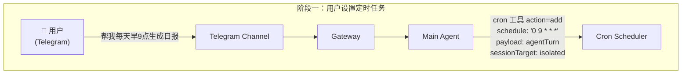
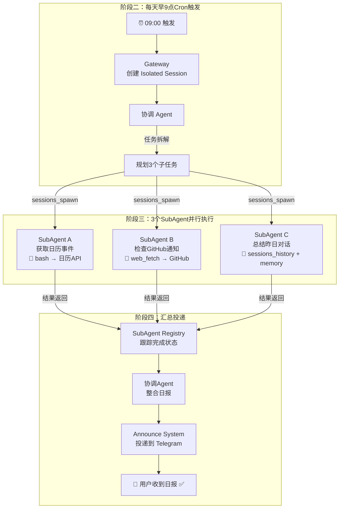
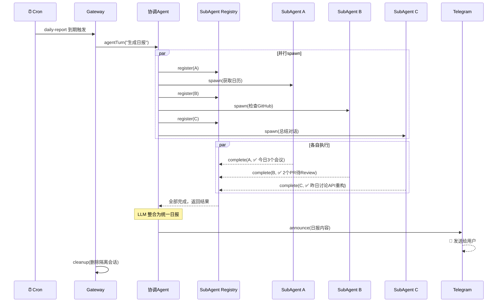

简单理解下龙虾（clawbot、openclaw）的架构，方便理解目前通用Agent的底层原理

# 龙虾（clawbot、openclaw）是什么

龙虾（clawbot、openclaw）是**一个在今年年初爆火的开源、可本地部署的个人AI助理与自动化平台**。
他是一个对话机器人，但又不仅仅是对话机器人。他更是一个能自主操作本地设备、管理文件、完成复杂任务的“数字管家”，只不过他的交互方式，主要依赖于聊天软件（如Discord、Telegram）的对话窗口。
用户可将其部署在MacOS/Windows/NAS上，并接入不同的大语言模型（LLM）。

# 为什么火爆

个人认为，虽然他不完美，但因为他提供了一整套利用大模型完成复杂任务的基础设施，并且结合目前能力最强的模型，他真的可以仅仅通过对话，来完成一些自动化的任务。而这些自动化任务，之前可能需要专业的人花费大量的时间来完成。

下面，我们就以一个典型的任务流，来看下为了实现这些功能，都需要用到什么。
# 典型任务流程

这个任务就是“每天早9点自动生成工作日报”。

在配置好的前提下，用户只需要通过聊天界面输入一句“帮我每天早9点自动生成前一天的工作日报”即可，输入之后，整个系统的简要流程如下：

其中，解释下面几个概念：
- `Telegram Channel`：你与龙虾的交互通道，可以换成任何一个支持的聊天软件，比如说`飞书`、`钉钉`等等。
- `Gateway`：网关，整个系统的**中央控制器**，用来统一管理不同 `Channel`的格式，同时也提供会话、配置、工具、管理、安全方面的配置管理。
- `Main Agent`：主智能体，用来干活的。
- `Cron Scheduler`：智能体用到的一个工具/技能，用来完成定时任务

设置好之后，龙虾会在后台做如下工作：

整个过程的时序图如下：

