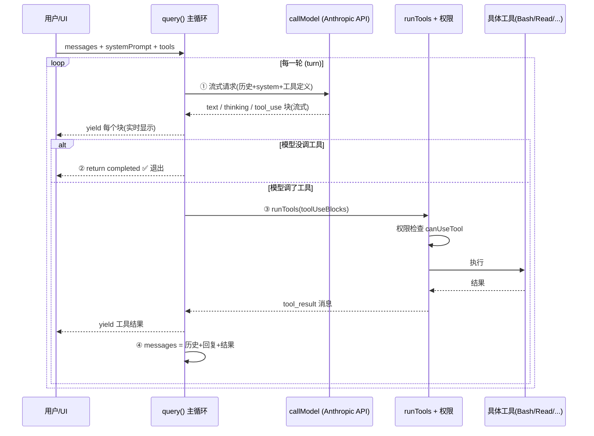

> 导读目标：理解 agent harness 的本质循环——什么时候继续、什么时候停。

## 1. 先看清骨架（剥掉 90% 的噪音）

`src/query.ts`（约 1730 行）绝大部分是**容错和优化**：自动压缩上下文（autocompact / microcompact / snip / collapse）、错误恢复（prompt-too-long、max-output-tokens、模型 fallback）、token 预算、工具调用摘要……

全部剥掉后，agent harness 的本质只有一个循环：

```ts
async function* query(params) {
  let messages = params.messages          // 对话历史
  while (true) {
    // ① 调 LLM（流式），把模型吐出的每个 block 实时 yield 给 UI
    const assistantMessages = []
    const toolUseBlocks = []
    let needsFollowUp = false
    for await (const message of callModel({ messages, systemPrompt, tools })) {
      yield message
      if (message 里有 tool_use) {
        toolUseBlocks.push(...)
        needsFollowUp = true       // ← 唯一的"要不要继续循环"信号
      }
    }

    // ② 模型没要求调工具 → 这一轮对话结束，退出
    if (!needsFollowUp) return { reason: 'completed' }

    // ③ 执行所有工具调用，收集结果
    const toolResults = []
    for await (const update of runTools(toolUseBlocks, canUseTool, ctx)) {
      yield update.message
      toolResults.push(update.message)
    }

    // ④ 把 [历史 + 模型回复 + 工具结果] 拼成新历史，回到 ①
    messages = [...messages, ...assistantMessages, ...toolResults]
  }
}
```

**整个 agent 就是这 4 步在转圈。** 任何 agent 框架（LangGraph、OpenAI Agents SDK、自研）骨架都是这个，Claude Code 只是把每一步做到了工业级。

### 对应真实代码行号

| 步骤 | 真实代码位置 |
|---|---|
| ① 调 LLM 流式 | `query.ts:659` `for await (const message of deps.callModel(...))` |
| ① 收集 tool_use | `query.ts:826-845` |
| ② 无工具→结束 | `query.ts:1062` `if (!needsFollowUp)` → `:1357 return {reason:'completed'}` |
| ③ 执行工具 | `query.ts:1380-1408`（`runTools` 或 `StreamingToolExecutor`）|
| ④ 拼接历史并循环 | `query.ts:1715-1727`（写 `state.messages` 然后 `while(true)` 回头）|

## 2. 时序图



## 3. 三个值得记住的设计决定

### ① 用 async generator（`async function*` + `yield`）

签名见 `query.ts:219`：`AsyncGenerator<StreamEvent | Message | ..., Terminal>`。
循环每产生一条消息就**立即 `yield`**，UI 实时渲染，不必等整轮结束。返回值 `Terminal`（`{reason: 'completed' | 'aborted' | ...}`）告诉调用方这轮**为什么**结束。这是流式 agent 的标准做法。

### ② `needsFollowUp` 是唯一的"继续/停止"开关

见 `query.ts:558` 注释和 `:834`：它**不**信任 API 的 `stop_reason === 'tool_use'`（注释明说 "unreliable"），而是自己在流里看到 tool_use 块就置位。
停止条件极简：**模型这一轮没有要求调任何工具 = 它认为任务说完了 = 退出。** 退出权完全在 LLM 手里。

### ③ 状态用不可变的 `State` 对象在迭代间传递

见 `query.ts:204-217` 的 `State` 类型和 `:1715` 的 `state = next`。
不用一堆散落的 `let`，而是每次循环结尾**整体替换** `state`。这样 7 个不同的 continue 点（各种恢复路径）都只需写 `state = {...}; continue`，不会漏字段。把复杂状态机写得可控的关键技巧，自己写 agent 时值得抄。

## 4. 那 90% 的"噪音"是什么（同心圆，第一遍可跳）

按重要性排：
- **工具执行** `runTools` / `StreamingToolExecutor`（`:1380`）→ 见第二讲。
- **上下文压缩**（autocompact `:454` / microcompact `:414` / snip / collapse）→ 历史太长时自动总结旧消息。
- **错误恢复**（`:893` 模型 fallback、`:1062-1256` prompt-too-long / max-output-tokens 恢复）。
- **stop hooks**（`:1267`）/ **token budget**（`:1308`）→ 用户可配置的"该不该停"扩展点。

这些都是**包在核心 4 步外面的同心圆**，理解中心后每层都能单独拆。

## 5. 本质：ReAct 循环

| ReAct | Claude Code 里的载体 |
|---|---|
| **Reason** | `thinking` block（+ `text`）|
| **Act** | `tool_use` block |
| **Observation** | `tool_result` block（回灌进 messages）|

历史是**追加**不是合并（`query.ts:1716`）：模型回复（assistant 消息）和工具结果（user 消息里的 tool_result 块）按顺序拼到历史末尾。API 硬性要求：`tool_use` 块必须有配对、对得上 id 的 `tool_result` 块——这也是出错时大量 `yieldMissingToolResultBlocks`（`:123`）补发空结果的原因，否则下一轮 API 直接 400。

**延伸**：既然"停不停"完全由 LLM 决定，影响其停止行为的杠杆只有两个——**system prompt 怎么写**（见第三讲）和**给它哪些工具**（见第二讲）。`stop hooks`（`:1267`）则是在它想停的瞬间注入消息把它拽回循环的强制手段。

---

## 课堂问答

**Q：如果模型在一轮里既输出了一段文字解释、又调用了 `Read` 工具，`needsFollowUp` 是 true 还是 false？循环会退出还是继续？**

**答（学员）**：`needsFollowUp` 看是否还需要调用工具。这一轮调了 `Read`，所以不会结束，会把工具结果和之前的文字解释合并后，让大模型再判断是否还需要调用工具，直到不用再调用时才退出。本质还是 ReAct——每一轮由 LLM reason 是否需要 act（act = 调用工具），不需要时就停止。

**核心正确。两处精确化：**

1. **是"追加"不是"合并"**。`query.ts:1716` `messages: [...messagesForQuery, ...assistantMessages, ...toolResults]`——模型回复（assistant 消息，含那段文字）和工具结果（user 消息里的 `tool_result` 块）是**按顺序拼到历史末尾**，不揉成一条。API 硬性要求 `tool_use` 块必须有配对、id 对得上的 `tool_result` 块。

2. **Reason 不只在"文字"里，还有独立的 `thinking` 块**。`query.ts:151-163` 那段注释讲的就是 thinking 块规则。精确的 ReAct 映射：Reason = `thinking`(+`text`)，Act = `tool_use`，Observation = `tool_result`。
