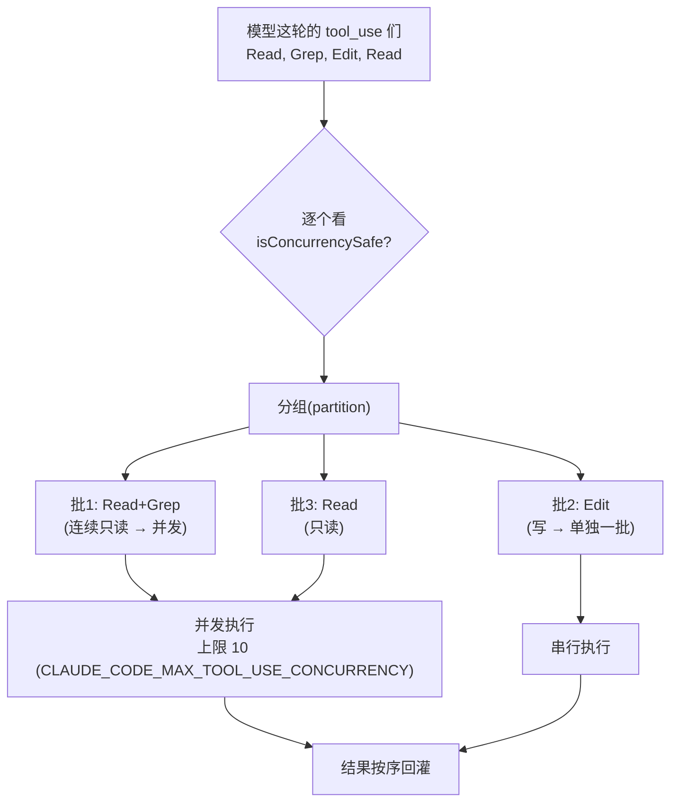
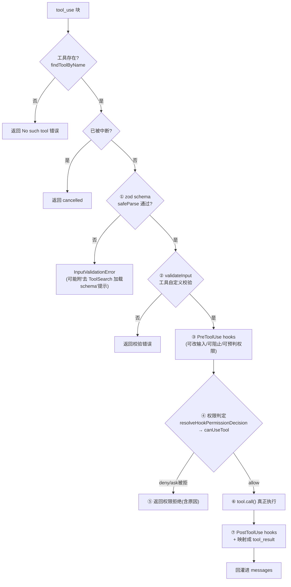

> 导读目标：理解工具的契约、调度（并发/串行）、以及一次调用的完整权限管线。

第一讲里被一笔带过的 `runTools(toolUseBlocks)`，展开后是 harness 里最讲究的部分。分三层看。

## 1. 一个 Tool 的契约（`src/Tool.ts:362`）

模型眼里的"工具"只是 JSON schema + 名字 + 描述。但 harness 里一个 `Tool` 是个有约 40 个方法的对象。**真正核心的只有 5 个**，其余全是 UI 渲染和遥测：

```ts
type Tool = {
  name: string
  inputSchema: ZodSchema          // ① 给模型的参数契约，也用来在本地校验
  description(): Promise<string>   // ② 给模型看的说明（动态生成）
  prompt(): Promise<string>        // ③ 注入到工具定义里的详细指引
  isConcurrencySafe(input): bool   // ④ 能不能和别的工具并行跑（决定调度）
  isReadOnly(input): bool          //   只读？
  checkPermissions(input, ctx): Promise<PermissionResult>  // ⑤ 权限判定
  call(input, ctx, ...): Promise<ToolResult>               // ⑤ 真正执行
  // …其余 30+ 个 renderXxx / getActivityDescription 都是终端 UI 用的
}
```

### 两个关键设计

- **`buildTool()` + `TOOL_DEFAULTS`（`Tool.ts:757`）= fail-closed 默认值**。没声明的方法自动填安全默认：`isConcurrencySafe→false`（假设不安全）、`isReadOnly→false`（假设会写）、`isDestructive→false`。**默认值都往更保守那边倒**——安全系统的标准姿势：忘了声明就当危险处理。

- **schema 既是给模型的契约，也是本地守门员**。同一个 `inputSchema`：(a) 序列化成 JSON Schema 发给 API；(b) 模型返回参数后在 `toolExecution.ts:615` 用 `safeParse` 再校验一遍。注释很诚实（`:614`）："the model is not great at generating valid input"——永远不信任模型输出。

## 2. 调度：只读并发，写操作串行（`src/services/tools/toolOrchestration.ts`）

模型一轮可能要求调好几个工具。`runTools` 先**分组**（`partitionToolCalls:91`）：



规则（`toolOrchestration.ts:84-116`）：
- **连续的只读工具**（`isConcurrencySafe===true`）合并成一批，**并发**跑，上限 10（`:8`）。
- **任何写操作**单独成批、**串行**跑。
- `:60` 的 `contextModifier`：写操作可能改变后续工具的上下文（Edit 改了文件，后面的 Read 要看新内容），所以写操作有顺序依赖，不能并发。

### 关键：保序 + 相邻合并（栅栏模型）

`partitionToolCalls` 按**原始顺序**走，只合并**连续**的只读工具。任何一个写操作都是一道**栅栏（barrier）**，把它前后的只读操作隔成不同批。

例：模型给出 `Read(a) Read(b) Edit(a) Grep` →
- 批1 `{Read a, Read b}` 并发
- 批2 `{Edit a}` 串行
- 批3 `{Grep}`（因为 Edit 横在中间，Grep 不能和前面的 Read 合并）

**为什么不能重排**：模型用**调用顺序**表达依赖（"改完 a 再 grep 看改动"）。harness 必须尊重顺序，否则 grep 看到的是改前的文件。这是经典的 read-set/write-set 依赖模型，用"保序 + 相邻合并"近似实现，不算依赖图但绝不会错序。

> harness 用 `isConcurrencySafe` 这一个布尔值把并发安全的复杂度全吃掉了——模型不需要懂线程安全。

## 3. 一次工具调用的完整管线（`src/services/tools/toolExecution.ts:599`）

`checkPermissionsAndCallTool` 是一道 **7 关闸门**，任何一关失败都直接返回 `is_error: true` 的 `tool_result`（喂回模型让它知道为啥失败），**绝不会** raw 执行：



| 关 | 位置 | 作用 |
|---|---|---|
| ① schema 校验 | `:615` `inputSchema.safeParse` | 类型不符直接退，还会提示模型"去 ToolSearch 加载完整 schema" |
| ② 业务校验 | `:683` `tool.validateInput?` | 工具特定逻辑（文件不存在、路径越界）|
| ③ Pre hooks | `:800` `runPreToolUseHooks` | 用户可配置拦截点：改输入 / 阻止 / 预先给权限决定 |
| ④ 权限 | `:921` `resolveHookPermissionDecision` → `canUseTool` | **核心闸门** |
| ⑤ 拒绝路径 | `:995` `if (behavior !== 'allow')` | 不执行，构造 error 结果回灌 |
| ⑥ 执行 | `:1207` `tool.call(callInput, ctx, ...)` | 唯一真正"做事"的地方 |
| ⑦ 收尾 | `:1292`+ `mapToolResult...` + PostToolUse hooks | 结果转 API 格式、跑后置 hooks |

### 权限判定（④）的本质

`checkPermissions` 返回 `{ behavior: 'allow' | 'deny' | 'ask', ... }`：
- `allow` → 直接执行
- `deny` → 直接拒绝
- `ask` → 弹窗问用户（交互模式）或按 permission mode 自动决定

**permission mode**（`default` / `plan` / `bypassPermissions` / `auto`）是改变"工具能不能跑"的全局开关。`plan` 模式下所有写工具被卡成 `ask`/`deny`——这就是为什么 plan mode 下 agent 只能看不能改。

### 一个贯穿全程的细节：输入会被改写多次

`callInput`（给 `call()`）≠ `processedInput`（给 hooks/权限看）。代码在 `:775-793` 和 `:1189-1205` 反复倒腾，因为 hooks 和权限系统都可能**修改输入**（如把相对路径展开成绝对路径），但又要保证最终 `call()` 拿到的路径和 transcript 记录一致（否则缓存/回放 hash 不上）。第一遍只需知道"输入在管线里可被改写"。

## 串联

```
query 主循环(第一讲)
   └─ needsFollowUp → runTools(第二讲)
                         ├─ partition: 只读并发 / 写串行
                         └─ 每个工具: 7关闸门 → call() → tool_result
                                              ↑ 权限在这里卡
   ← tool_result 回灌 messages → 再问模型
```

---

## 课堂问答

**Q：模型在一轮里同时要求 `Read(a.ts)`、`Read(b.ts)`、`Edit(a.ts)`、`Grep("foo")`。按 `partitionToolCalls` 会分成几批？每批并发还是串行？为什么 Edit 不能和两个 Read 并发？**

**答（学员）**：分成两批——`Read(a)`、`Read(b)`、`Grep` 一批可并发，`Edit(a)` 第二批。Edit 会改变文件内容，不能和 Read 并发，否则结果混乱。

**"为什么 Edit 危险"答对了；批数踩了坑——正确是 3 批，不是 2 批。**

关键：`partitionToolCalls`（`toolOrchestration.ts:95-115`）按**原始顺序**走，只合并**连续**的只读工具。模型给的顺序是 `Read(a) Read(b) Edit(a) Grep`：

| 工具 | safe? | 上一批 | 结果 |
|---|---|---|---|
| Read(a) | ✅ | （空）| 新建 批1[Read a] |
| Read(b) | ✅ | 批1 safe | 并入 → 批1[Read a, Read b] |
| Edit(a) | ❌ | — | 新建 批2[Edit a] |
| Grep | ✅ | 批2 **不** safe | **新建** 批3[Grep] |

所以 **批1{Read a,Read b} 并发 → 批2{Edit a} 串行 → 批3{Grep}**。Grep 因为被 Edit 隔开，**不能**和前面的 Read 合并。

**为什么不重排**：模型用**调用顺序**表达依赖（"改完 a 再 grep 看改动"）。若把 Grep 提前和 Read 并发，grep 看到的是改前的文件，逻辑被破坏。**任何写操作都是一道栅栏(barrier)，把前后的只读操作隔成不同批。**
