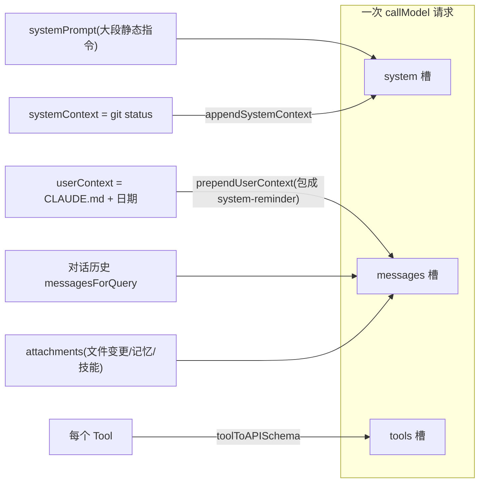
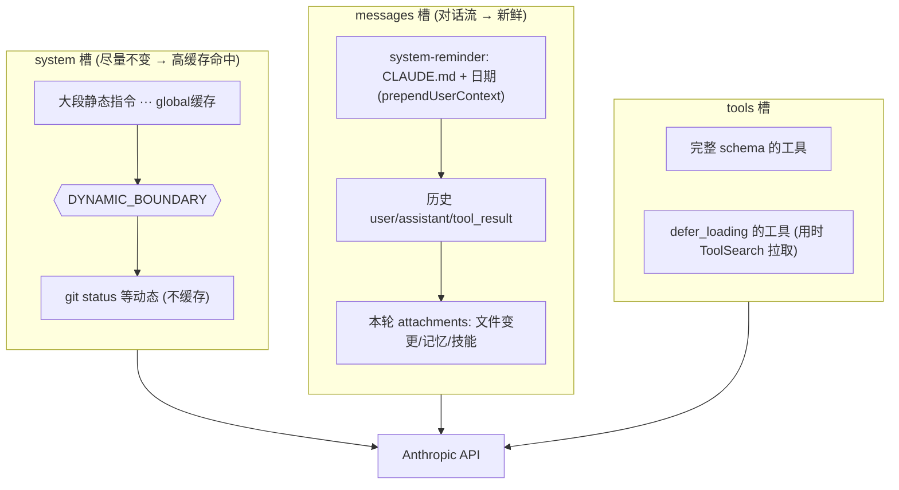
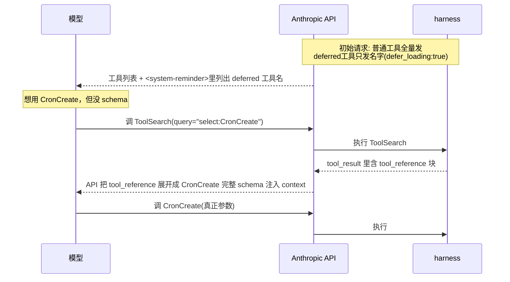

> 导读目标：把 `callModel({ messages, systemPrompt, tools })` 三个参数彻底拆开，理解"模型每轮到底看到了什么"，以及为什么这么拼（答案：prompt 缓存经济学）。

## 0. 拼装点

主循环 `query.ts:659`，每轮请求就这一句：

```ts
deps.callModel({
  messages: prependUserContext(messagesForQuery, userContext),  // 对话历史 + 用户上下文
  systemPrompt: fullSystemPrompt,                               // 系统指令 + 系统上下文
  tools: toolUseContext.options.tools,                          // 工具定义
})
```

`fullSystemPrompt`（`query.ts:449`）= `appendSystemContext(systemPrompt, systemContext)`。

一次 API 请求 = **三块拼装**，对应 Anthropic API 的 `{ system, messages, tools }`。关键设计：同样是"上下文"，**塞进 system（全局指令位）还是 messages（对话流位）取决于它是否会变**。



## 1. system 槽：静态指令 + 系统上下文

- **`systemPrompt`**：定义 Claude Code 人格和行为准则的大段指令，每轮基本不变。
- **`systemContext`**（`context.ts:116` `getSystemContext`）：往 system 末尾追加，目前主要是 **git status**（`context.ts:36`）——分支、主分支、`git status --short`、最近 5 条 commit。

注意 `context.ts:97` 写给模型的话："This is the git status at the start of the conversation … will not update during the conversation." 这句**本身就是 prompt engineering**：git status 只在会话开始抓一次（`memoize` 缓存），不说清模型会误以为是实时的。`appendSystemContext`（`api.ts:437`）把它按 `key: value` 拼成 block 贴到 system 末尾。

## 2. messages 槽：用户上下文被包成「system-reminder」

**`userContext`**（`context.ts:155` `getUserContext`）含 **CLAUDE.md / memory 文件** + **当前日期**。它**不进 system**，而是通过 `prependUserContext`（`api.ts:449`）包成一条 `isMeta: true` 的 user 消息插到历史最前面：

```
<system-reminder>
As you answer the user's questions, you can use the following context:
# currentDate  Today's date is ...
IMPORTANT: this context may or may not be relevant to your tasks.
You should not respond to this context unless it is highly relevant to your task.
</system-reminder>
```

两个意图：
1. `<system-reminder>` 标签 + "may or may not be relevant" → 告诉模型"这是背景资料，别当用户指令回应"，避免每轮对着日期寒暄。
2. 放 messages 而非 system → 因为它可能变（CLAUDE.md 可编辑、日期跨天），放进对话流不破坏 system 缓存。

## 3. tools 槽：每个工具序列化成 schema

`toolToAPISchema`（`api.ts:119`）把 `Tool` 转成 API 格式，核心三件：
- `name`
- `description` ← `tool.prompt()`（给模型的详细使用说明）
- `input_schema` ← `zodToJsonSchema(tool.inputSchema)`

两个机制（详见补讲 B）：
- **`defer_loading`（`:224`）= 延迟加载**：工具太多占爆 context，一部分只发名字、用时再 ToolSearch 拉取完整 schema。
- **schema 缓存（`:147`）**：避免 GrowthBook 标志位中途翻转导致 schema 字节变化、击穿 prompt 缓存。

## 4. 动态注入：attachments（每轮可能不同的"观察"）

每轮结尾通过 `getAttachmentMessages`（`query.ts:1580`）往 messages 注入：
- **文件变更**：用户在外部改了文件 → `edited_text_file` attachment
- **记忆 prefetch**（`query.ts:1599`）
- **技能发现**（`query.ts:1620`）
- **排队的命令/通知**

这是 ReAct "Observation" 的扩展——不只工具结果，还包括环境变化。

## 5. 为什么这么分？答案是 prompt caching（题眼）

Anthropic API 支持 prompt 缓存：前缀不变的部分可命中缓存，省钱省延迟。所以拼装策略全是**"不变的放前面、可变的放后面"**。

`splitSysPromptPrefix`（`api.ts:321`）把 system 切块，关键是 `SYSTEM_PROMPT_DYNAMIC_BOUNDARY`（`:362`）分界标记：

```
[归属头] [系统提示前缀] [静态内容 ← cacheScope:'global'] │boundary│ [动态内容 ← cacheScope:null]
                                      ↑ 可跨会话缓存                      ↑ 不缓存
```

- boundary 之前：纯静态指令 → `cacheScope:'global'`，甚至跨用户/会话共享。
- boundary 之后：会变的 → 不缓存。

这解释了第 1、2 节的分配：git status 放 system 靠后/动态区；CLAUDE.md、日期更易变，干脆移出 system 放进 messages。

**一句话**：context 怎么拼 = 一道「缓存命中率 vs 信息新鲜度」的优化题。越靠前 = 越想被缓存 = 越必须不变；越靠后/越进 messages = 越新鲜 = 放弃缓存。

## 6. 全景图



---

# 补讲 A：system message 里到底塞了什么

入口 `getSystemPrompt`（`prompts.ts:444`）返回字符串数组，最后 join 成 system（`prompts.ts:560-576`）：

```ts
return [
  // ── 静态区(可全局缓存) ──
  getSimpleIntroSection(),        // "You are Claude Code, Anthropic's official CLI..."
  getSimpleSystemSection(),       // 安全/IMPORTANT 准则
  getSimpleDoingTasksSection(),   // 怎么做编码任务的方法论
  getActionsSection(),
  getUsingYourToolsSection(tools),// 工具使用总则(按启用工具动态生成)
  getSimpleToneAndStyleSection(), // 语气风格: file_path:line_number、别用emoji…
  getOutputEfficiencySection(),
  SYSTEM_PROMPT_DYNAMIC_BOUNDARY, // ← 第三讲那个分界标记就在这里
  // ── 动态区(registry 管理，每段独立缓存) ──
  ...resolvedDynamicSections,     // session_guidance, memory, env_info,
                                  // language, output_style, mcp_instructions,
                                  // scratchpad, summarize_tool_results …
].filter(Boolean)
```

要点：
1. **静态区 = Claude Code 的"宪法"**：会话开头那一大坨 "You are Claude Code…"、安全准则、Tone and style（`file_path:line_number` 规则在 `:436`）全来自这里。
2. **每段独立缓存**（`systemPromptSections.ts`）：
   - `systemPromptSection(name, compute)`（`:20`）：算一次，缓存到 `/clear` 或 `/compact`。
   - `DANGEROUS_uncachedSystemPromptSection`（`:32`）：每轮重算、**会击穿缓存**，函数名带 `DANGEROUS_` 并强制传 `_reason`。唯一用它的是 `mcp_instructions`（`prompts.ts:513`），理由是"MCP 服务器轮次间连接/断开"。→ 把"缓存友好"从口头约定变成类型签名级强制。
3. **git status / 日期不在这里**：git status 由 `appendSystemContext` 贴到数组末尾；CLAUDE.md/日期被踢进 messages。完整 system = `[静态宪法] + boundary + [动态sections] + [git status]`。
4. **极简兜底**：`CLAUDE_CODE_SIMPLE=1` 时（`:450`）整个 system 缩成一行。

---

# 补讲 B：tool 怎么进 context + defer 怎么实现

## 常规路径

`tools` 数组每个 `Tool` → `toolToAPISchema`（`api.ts:119`）→ `{ name, description: tool.prompt(), input_schema }`。模型一上来就看到完整定义。

## defer 的本质：先给名字，用时再给 schema

**问题**：工具越多（尤其 MCP，一个服务器几十个工具），每个完整 schema 都烧 token，全量塞能吃掉 10%+ context window。

**解法**：`isDeferredTool`（`ToolSearchTool/prompt.ts:62`）决定谁 defer：

```ts
if (tool.alwaysLoad) return false       // 显式豁免 → 全量加载
if (tool.isMcp) return true             // MCP 工具一律 defer
if (tool.name === ToolSearch) return false  // ToolSearch 自己绝不 defer
return tool.shouldDefer === true        // 其余按工具声明
```

被 defer 的工具 schema 打 `defer_loading: true`（`api.ts:224`）。**模型只看到名字、看不到参数 schema，没法直接调用。**

## 完整闭环



落地细节：
- **解锁状态靠扫历史**：`extractDiscoveredToolNames`（`toolSearch.ts:545`）每轮扫历史里的 `tool_reference` 块，得出已解锁工具，后续请求带上其完整 schema。解锁是持久的（记录在历史里）。
- **防呆提示**：没解锁就硬调 → zod 校验失败 → `buildSchemaNotSentHint`（`toolExecution.ts:578`）追加"先用 ToolSearch 加载再重试"。
- **三种模式**（`getToolSearchMode:172`）：`tst`(总是 defer，默认) / `tst-auto`(超过 context ~10% 才 defer，`:49`) / `standard`(关闭)。
- **兼容性**：`tool_reference` 是 beta 特性，Haiku 不支持（`:204`），第三方代理常不支持 → 一堆降级判断。

## takeaway

system 和 tools 的拼装全程被一条主线统治：**token 和缓存的经济学**。
- system → 静态/动态分段缓存，会变的段被 `DANGEROUS_` 标记。
- tools → 用得着的全量、用不着的只发名字(defer)。

同一工程哲学的两面：**context window 是稀缺资源，每个 token 都要为它的位置付费**。

---

## 课堂问答

**Q：为什么 CLAUDE.md 被放进 messages 槽（包成 system-reminder 的 user 消息），而不是直接拼进 system 槽？如果放进 system 静态区会有什么代价？**

**答（学员）**：主要是为了提高缓存命中率。CLAUDE.md 内容可能会变，如果放在 system 槽里，一旦变化就会造成缓存失效、增加成本。

**完全正确。** 补一句机制细节：system 静态区被标为 `cacheScope:'global'`（`api.ts:362`，boundary 之前），可跨会话/跨用户共享缓存——前缀字节一旦变了，这整段昂贵的全局缓存就击穿了。CLAUDE.md 可被用户随时编辑、属于"易变"，放进对话流（messages）既不破坏 system 缓存，又能保证新鲜。这正是"不变的放前面争取缓存、可变的放后面/进 messages 放弃缓存"这条主线的直接体现。

> 延伸：system 内部也不是一把缓存，而是**分段**缓存（补讲 A）。会变的段必须用 `DANGEROUS_uncachedSystemPromptSection` 显式声明并写明理由——把"缓存友好"从口头约定变成类型签名级强制。

---

# 补讲 C：工具调用 API 格式 —— Anthropic vs OpenAI 对比

> 见 [附录-工具调用API格式对比.md](附录-工具调用API格式对比.md)。

要点速查：
- Anthropic `tool_use` 在 assistant 的 `content[]` 里，`input` 直接是对象；OpenAI 用独立的 `tool_calls[]`，`arguments` 是 JSON 字符串需二次 parse。
- Anthropic 工具结果放 `role:"user"` 的 `content[]`（与普通 text 块混排）；OpenAI 有独立的 `role:"tool"`。
- Anthropic 消息只有 user/assistant 两种 role，这是 `tool_result` 必须归入 user 的根本原因，也是 `getAttachmentMessages` 能把文件变更、记忆 prefetch 等 text 块注入**同一条** user 消息的基础。
