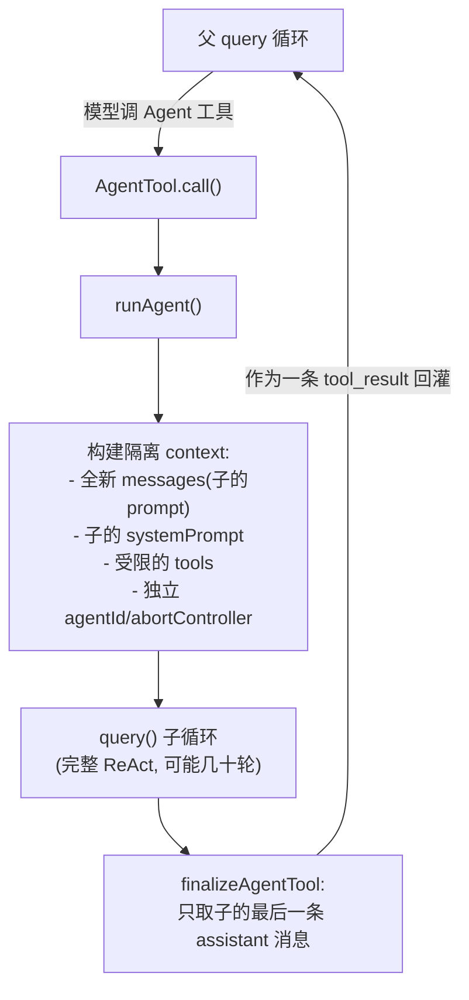
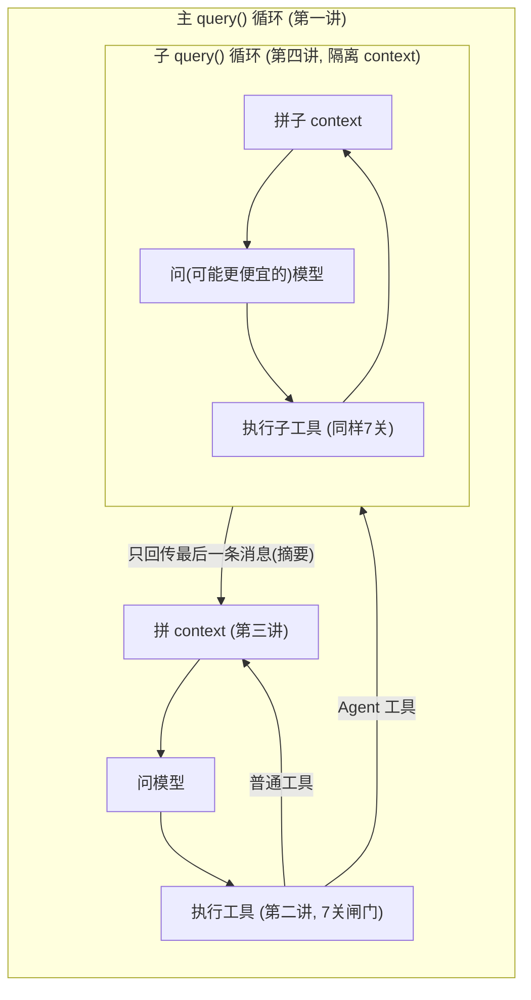

> 导读目标：理解多 agent 架构的本质（query 的递归嵌套）、子 agent 的核心价值（context 隔离）与它内在的代价（信息瓶颈）。

## 0. 一句话戳破：子 agent 就是"再跑一遍主循环"

看 `src/tools/AgentTool/runAgent.ts:748`：

```ts
for await (const message of query({          // ← 第一讲那个同一个 query()！
  messages: initialMessages,
  systemPrompt: agentSystemPrompt,
  userContext: resolvedUserContext,
  systemContext: resolvedSystemContext,
  canUseTool,
  toolUseContext: agentToolUseContext,       // ← 但是一个全新隔离的 context
  querySource,
  maxTurns: maxTurns ?? agentDefinition.maxTurns,
}))
```

**没有"子 agent 引擎"这种东西。** 一个子 agent = 用一套独立的 messages / systemPrompt / tools / agentId / abortController 再调一次第一讲那个主循环。整个系统是 `query()` 的**递归嵌套**：

```
主 query 循环
  └─(模型调 AgentTool)→ runAgent → query 循环 (子)
                                      └─(子模型又调 AgentTool)→ runAgent → query 循环 (孙)
```

你已经懂的那一套（循环、工具管线、context 拼装）原封不动套用到每一层 agent。

## 1. 触发路径：AgentTool 是一个"会生孩子"的工具

父 agent 调用名为 `Agent` 的工具（`AgentTool.tsx`），走第二讲一样的 7 关管线——只是它的 `call()` 干的事是 spawn 子 agent：



## 2. 核心价值：context 隔离

`AgentTool.tsx:1207` 和 `finalizeAgentTool`（`agentToolUtils.ts:276-304`）：

```ts
const lastAssistantMessage = getLastAssistantMessage(agentMessages)
let content = lastAssistantMessage.message.content.filter(_ => _.type === 'text')
```

**子 agent 可能内部跑了 50 轮、调了 80 次工具、读了几十个文件，但返回给父 agent 的只有它的最后一条消息。** 中间庞大的探索过程全部留在子 agent 自己的 context 里，不进父 agent 的历史。

| 没有子 agent | 用子 agent |
|---|---|
| "搜遍代码库找 X" 的几十个结果全塞进主对话 | 子 agent 在自己 context 里搜，主对话只多一段摘要 |
| 主 context 迅速被探索噪音撑爆 | 主 context 只增长一段摘要 |

这是第三讲主线"context window 是稀缺资源"在**架构层**的终极手段：把会产生大量中间垃圾的子任务，外包到一次性隔离上下文里。

## 3. 并行：agent swarm

`AgentTool.tsx:1273` `isConcurrencySafe() { return true }`。按第二讲调度规则，concurrency-safe 工具并发执行（上限 10）。所以模型一轮调 4 次 `Agent`，4 个子 agent 并行跑——agent swarm 就是复用第二讲的 `runToolsConcurrently`，无需额外并行框架。

## 4. 权限：spawn 免审，子 agent 的工具照样过闸

`AgentTool.tsx:1264` `isReadOnly() { return true }`（"delegates permission checks to its underlying tools"）。spawn 动作本身自动批准，但子 agent 循环里调的每个 Bash/Edit/Write 依然各自走 7 关管线，且更收紧：
- `resolveAgentTools`（`runAgent.ts:500`）裁剪工具池（Explore/Plan 拿不到写工具）。
- `allowedTools`（`:469`）可完全替换允许规则，父的批准不泄漏给子。
- 子可定义 `permissionMode`（`:415`），但父的 `bypassPermissions`/`acceptEdits` 优先，子不能擅自降低安全等级。

## 5. 每个 agent 可配置（`AgentDefinition`）

| 配置 | 作用 | 代码 |
|---|---|---|
| `model` | 子 agent 用哪个模型（常用更便宜/快的）| `runAgent.ts:340` |
| `tools` | 工具子集 | `:500` |
| `permissionMode` | 权限模式 | `:415` |
| `systemPrompt` | 子 agent 人格/指令 | `:508` |
| `maxTurns` | 最多跑几轮（防失控）| `:756` |
| `skills`/`mcpServers` | 预加载技能、专属 MCP | `:578`/`:648` |

内置 agent：`Explore`、`Plan`、`general-purpose`、`claude-code-guide`、`statusline-setup`。

## 6. 一堆为"省 token"做的优化

子 agent 在车队规模跑了上亿次，代码里全是抠 token 的细节：
- **Explore/Plan 丢掉 CLAUDE.md**（`:386-398`）：只读 agent 不需要 commit/PR 规则。"saves ~5-15 Gtok/week across 34M+ Explore spawns"。
- **Explore/Plan 丢掉 git status**（`:400-410`）：stale git status（最大 40KB）对搜索 agent 是死重量。
- **普通子 agent 关闭 thinking**（`:682`）：`thinkingConfig: { type: 'disabled' }`。

## 7. 同步 vs 异步

- **同步**（默认）：和父共享 `abortController`、`appState`（`:524`）。父停子也停，父等子跑完。
- **异步**（`isAsync`）：独立的不联动 `abortController`（`:527`），后台独立跑。background agents / `claude ps` 的基础。

---

## 深度洞见：子 agent 是一笔"用信息损失换 context 空间"的交易

> 子 agent 的**核心价值**（只回传最后一条消息）和它最大的**局限**，是同一个机制。

### (a) 信息瓶颈：哪类任务绝对不该用子 agent

**判据：当任务的产出本身就是"大量结构化细节"而非"一个结论"时，针孔就是致命的。**

反例——**让子 agent 做跨 20 个文件的重命名重构**：
- 产出不是一句总结，而是 20 处精确、关联的改动。
- 子 agent 只能把它压缩成"我都改了"，父 agent **失去对改动的可见性和可审计性**。
- 第 13 个文件改错了，父 agent 无从知晓，只能"信任"那段可能撒谎的摘要。

判据：如果父 agent **需要看见过程本身**（审计/基于细节做下一步/出错定位），就不该用子 agent——子 agent 的前提是"过程不重要、只要结论"。重命名重构、逐行 review、需要精确 diff 的编辑都属于"过程即产出"，应在主循环直接做。

适合子 agent 的特征：**问题很大、答案很小**。"bug 根因在哪"——搜半个代码库（大），结论是"auth.ts:42 空指针"（小）。针孔在这里是恰好的过滤。

### (b) 并行的盲区：彼此看不见会出什么问题

**核心：并行子 agent 之间没有通信信道，任何共享状态/隐含依赖都会变成竞态或不一致。**

场景——**4 个子 agent 并行给 4 个模块加同一个 logging 中间件**：
1. **重复决策、互相打架**：各自"发明"不兼容的接口约定，父拿回 4 段摘要才发现要返工。
2. **共享文件写竞争**：都要往 `index.ts` 注册 → 并发写覆盖。第二讲"写操作串行"的规则**只在单 agent 工具调度层生效，跨 agent 边界完全失效**——子 agent 之间没有 `partitionToolCalls` 那道栅栏。
3. **隐含依赖被打破**：模块 B 依赖模块 A 的类型，但并行跑时 agent2 看到的是 agent1 未完成的旧状态。

硬约束：并行 spawn 前**必须保证子任务真正独立（embarrassingly parallel）**——无共享写入、无顺序依赖、无需统一约定。一旦有协调需求，要么串行 spawn（让 agent1 摘要进入 agent2 的 prompt），要么别拆。

这是分布式系统老问题：并行只对无共享状态免费。子 agent 架构**故意不提供跨 agent 同步原语**，把"保证独立性"的责任完全压给父 agent 的拆解能力。

### (c) 嵌套的代价：3 层会发生什么

**每层边界做一次有损压缩，3 层嵌套 = 一条压缩链。**

孙 → 子 → 父：
- 孙 agent：100 个细节单位 → 压缩成 10 个传给子。
- 子 agent：消化那 10 个、再压一次 → 传给父剩 3 个。
- 父 agent：拿到"摘要的摘要的摘要"，且每层压缩都可能引入失真（传话游戏）。

**为什么 agent 树实践中很浅（1-2 层）**：
- 信息论：有损压缩不可逆且累积。深度每加一层，顶层信息保真度指数级下降，失真概率累积上升。
- 成本：每层 spawn 有固定开销（全新 system prompt，非 fork 子 agent **不共享父的 prompt 缓存**、重读文件、重建 context）。深度嵌套 = 为"信息越来越少"付"成本越来越高"，双输。
- 对比：扁平并行（一父 + N 并列子）只压缩一次，N 个子独立无失真传播——"宽而浅"几乎总优于"窄而深"。

### 收束

> **子 agent 不是"更强的工具"，而是"用确定性的信息损失换 context 空间"的一笔交易。**

- (a) 什么任务的损失不可接受 → 过程即产出的任务。
- (b) 并行只在无共享时免费 → 协调需求会让交易破产。
- (c) 损失沿嵌套链累积 → 别叠太深。

判断该不该 spawn，本质是问：这个子任务是**"问题大、答案小"（划算）**，还是**"答案本身很大、或需协调、或要被审计"（赔本）**？

---

## 四讲全景：harness 是 query() 的递归



**agent harness 的四根支柱**：
1. **循环**（什么时候停）
2. **工具管线**（怎么安全地 act）
3. **context 拼装**（模型看到什么、token 经济学）
4. **递归 agent**（隔离 context 外包子任务 + 并行 swarm）

贯穿全部的主线：**一切设计都在为 context window 这个稀缺资源服务**——缓存命中率、defer 加载、子 agent 隔离，都是它的不同侧面。
