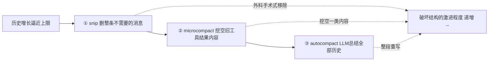
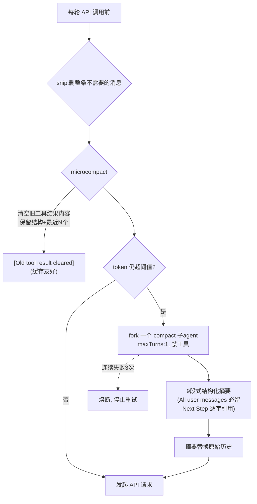

> 导读目标：理解 harness 如何在固定 context window 下应对只增不减的对话历史——一套按"代价/信息损失"递增的三层压缩防线。

## 0. 问题

第一讲的循环每轮都往 `messages` 追加（模型回复 + 工具结果），**历史只增不减**。但 context window 固定（如 200k token），长会话——尤其工具结果（`Read` 大文件、`Bash` 大量输出）——很快撑爆。

解法是**按"代价/损失"递增的三层防线**，对应 `query.ts` 调用顺序（`:401 snip → :414 microcompact → :454 autocompact`）：



**设计哲学**：先用最便宜、最不破坏结构的手段，扛不住才升级。延续主线——省 token，但尽量少丢信息。

## 1. 第一层 snip：选择性删除整条消息（模型可主动发起）

> ⚠️ snip 的实现本体 `snipCompact.js` 不在泄露包里（被 `HISTORY_SNIP` feature 门控的内部模块，`query.ts:116` 是桩）。以下从调用点 + 散落注释还原。

**snip = 删除整条被判定"不再需要"的消息**，三层里唯一**模型自己有发言权**的一层：
- `tools.ts:123` 注册了 `SnipTool`——模型能主动调用它说"这段我用完了，删掉"。
- `/force-snip` 命令（`commands.ts:83`）让用户强制触发。
- `shouldNudgeForSnips`（`attachments.ts:3959`）每约 10k token nudge 一次模型，提示它考虑 snip。
- 自动启发式 `snipCompactIfNeeded`（`query.ts:403`）每轮也跑一遍，返回 `{ messages, tokensFreed, boundaryMessage }`。

**和 microcompact 的本质区别：snip 删整条消息，microcompact 只挖空 tool_result 内容。** 证据 `controlSchemas.ts:359`："a prior Read was removed from context (e.g. by snip) so Edit validation would fail" —— snip 能把一整条 `Read` 消息删掉（连带它会引发副作用：Edit 的"必须先 Read"校验失效，需要 re-seed readFileState，见第六讲权限/校验）。

**用投影实现**（`QueryEngine.ts:125` `snipProjection` / `projectSnippedView`）：REPL 底层数组**保留**被 snip 的消息供 UI 回滚（`commands/compact/compact.ts:44`），但**发给 API 的视图**移除它们。和 context-collapse 同一套"底层留全量、API 看投影"的机制。snip 会**保护携带 tool_reference 的消息**（`toolSearch.ts:540`），否则 defer 工具的解锁状态会丢（第三讲）。

> 💡 snip 是最符合 agent 自主性的设计：autocompact/microcompact 都是 harness 背着模型做的机械操作；snip 把"哪些上下文我已经用完了、可以扔"的判断权交给**正在思考的那个 agent 自己**。

> snip 省下的 token 通过 `snipTokensFreed`（`query.ts:405,466`）传给下游的 microcompact/autocompact 阈值判断——因为存活的 assistant 消息的 usage 仍反映 snip 前的 context 大小，`tokenCountWithEstimation` 看不到 snip 的节省，必须显式减掉。

## 2. 触发时机：proactive vs reactive

- **proactive（主动）**：每轮 API 调用**之前**估算 token，超阈值就先压。`shouldAutoCompact`（`autoCompact.ts:160`）。
- **reactive（被动）**：API 真返回 `prompt_too_long`(413) 才兜底触发 `reactiveCompact`（`query.ts:1119`）。

阈值（`autoCompact.ts:72`）：
```
有效窗口 = context window − 20k(给总结预留)
autocompact 阈值 = 有效窗口 − 13k 缓冲
```
留 20k 因总结输出本身占 token（p99.99 总结 = 17,387 token）；留 13k 缓冲避免卡到最后一刻。

## 3. 第二层 microcompact：精准清空"旧工具结果"（最聪明的一层）

**不动对话结构，只把旧的、最占空间的工具结果内容挖空。**

`microCompact.ts:41` 的 `COMPACTABLE_TOOLS`：`FileRead, Bash, Grep, Glob, WebSearch, WebFetch, FileEdit, FileWrite`。

**为什么只动这些**：它们"最占 token 又最易过期"——20 轮前 Read 的 500 行文件，模型早已基于它行动，原始内容现在是死重量。但**对话结构必须保留**（`tool_use`/`tool_result` 配对、id 不能破坏，否则 API 400）。

做法：保留最近 N 个工具结果，把更早的**内容**替换成占位符（`microCompact.ts:36`）：
```
[Old tool result content cleared]
```
tool_result 块还在、id 还在、结构完整，只是内容挖空（`:461-492`）。

两个变体，都极度照顾缓存：
- **time-based（`:446`）**：距上一条 assistant 消息超时触发。妙处：**这时服务端缓存已过期**，prefix 反正要重写，趁机清旧内容让重写更小——"既然要付钱，就顺便打扫"。
- **cached microcompact（`:305`）**：用 cache-editing API **删旧工具结果但不破坏缓存 prefix**（messages 本地不变，cache_edits 在 API 层加）。缓存友好的极致。

> microcompact 是"定向有损压缩"：精确知道哪部分信息（旧文件内容）价值最低、体积最大，只切这部分。对比 autocompact 的全量重写，这是外科手术 vs 截肢。

## 4. 第三层 autocompact：LLM 把整段历史总结成结构化摘要

扛不住才动用最重手段：**让一个 LLM 把整个对话总结成结构化摘要，用摘要替换原始历史**。

实现（`compact.ts` 的 `compactConversation`，由 `autoCompactIfNeeded:312` 调用）：一个 **fork 子 agent**（`querySource:'compact'`、`maxTurns:1`、禁用工具），跑专门的总结 prompt。

总结 prompt（`prompt.ts:61` `BASE_COMPACT_PROMPT`）强制 9 段：
```
1. Primary Request and Intent   —— 用户原始诉求(最重要,第一)
2. Key Technical Concepts
3. Files and Code Sections      —— 含完整代码片段
4. Errors and fixes             —— 特别强调"用户让你改的地方"
5. Problem Solving
6. All user messages            —— 列出所有非工具结果的用户消息(防丢用户意图)
7. Pending Tasks
8. Current Work
9. Optional Next Step           —— 含逐字引用,防任务漂移
```

prompt engineering 精妙处：
- **`<analysis>` 草稿区**（`:31`）：先梳理再写 `<summary>`，提升质量。但 `formatCompactSummary`（`:311`）**写完即剥掉**，不进最终 context——用 token 换质量、但只是临时的。
- **"All user messages" 段**（`:73`）：要求列出所有用户消息。总结最怕丢用户意图——别的可模糊，用户说过的必须保。
- **"Optional Next Step" 逐字引用**（`:77`）：`verbatim to ensure there's no drift`，防止"下一步该干嘛"被理解偏。
- **`NO_TOOLS_PREAMBLE`**（`:19`）：反复强调只输出文本。因为 fork agent + `maxTurns:1`，手贱调工具被拒就浪费唯一一轮、产不出总结。

总结完，旧消息换成"这是之前对话的摘要…"（`getCompactUserSummaryMessage:337`），附一句关键的（`:359`）：
> "Continue ... without asking the user any further questions. Resume directly — do not acknowledge the summary, do not recap..."

避免压缩后模型说废话，直接无缝接上。

> autocompact = 让一个 fork agent 把"过去的你"压成一段摘要。和第四讲子 agent 的"有损压缩"同思想，只不过这次被压缩的是自己的历史。

## 5. 组合与熔断

- **三层叠加，不互斥**（`query.ts:401-468`）：snip→microcompact→autocompact 依次跑，每层把已省 token 传给下层（如 `snipTokensFreed`）避免重复判断。
- **熔断器**（`autoCompact.ts:70,260`）：autocompact 连续失败 3 次就停。若 context 已不可逆超限（单条消息就超窗口），每轮试压只会狂烧 API。注释数据："1,279 个会话单次出现 50+ 连续失败（最高 3,272），每天全球浪费约 25 万次 API 调用"——熔断器堵的就是这个。

## 6. 全景



## takeaway

上下文压缩是一条**激进程度递增的梯度**：
- snip 删整条"已用完"的消息（外科手术式，**模型可主动判断**，无 LLM）
- microcompact 挖空"已消费的旧工具结果"内容（保留结构，机械启发式，无 LLM）
- autocompact 把一切压成摘要（整段重写，唯一动用 LLM，用结构化 prompt + 必留用户消息兜底）

每层都在回答同一个问题：**token 预算耗尽时，先扔哪些信息损失最小？** 这是 context 工程的核心智慧。三层互补：snip 让 agent 自主丢弃、microcompact 批量清理最大宗的死内容、autocompact 是最后的全量兜底。

> 关联：第三讲（context 拼装/缓存经济学）、第四讲（子 agent 的有损压缩）。autocompact 本质是"对自己历史的子 agent 式压缩"。

---

> **延伸**：microcompact 只挖空 `tool_result` 的**内容**、不动 id 和结构块，根本原因是 Anthropic API 要求 `tool_use` / `tool_result` 必须 id 配对，结构破坏即返回 400。Anthropic 与 OpenAI 在工具调用格式上的完整差异见 [附录-工具调用API格式对比.md](附录-工具调用API格式对比.md)。
