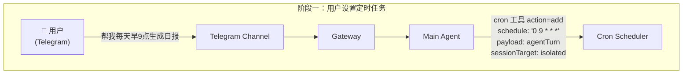
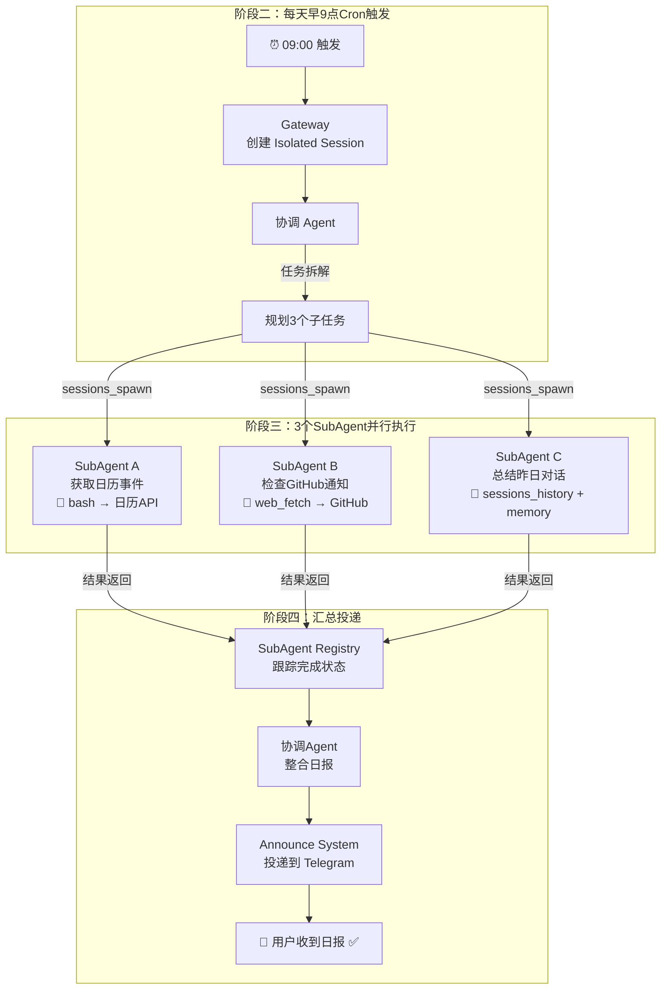
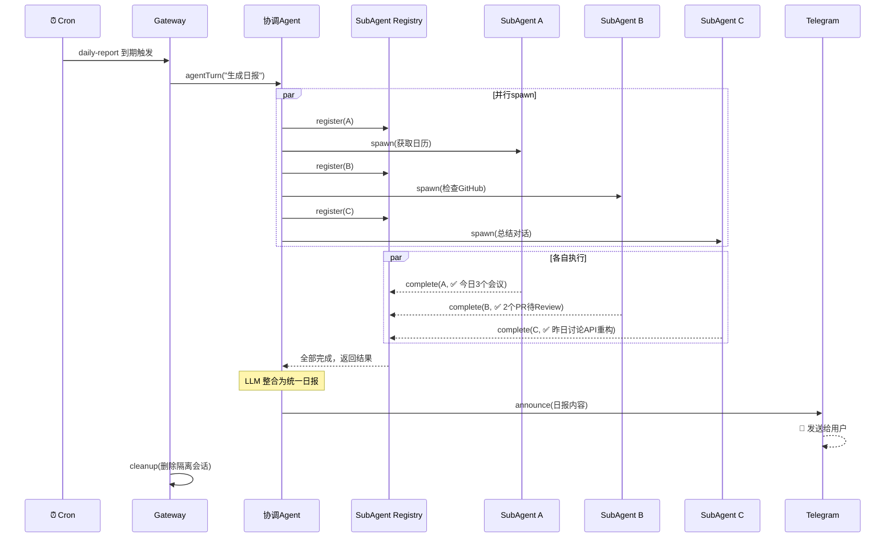

# 一个任务流，看懂AI Agent到底怎么干活

大家好，我是算法工程笔记。

周五了，聊点轻松的。最近有个开源项目叫**龙虾**（OpenClaw），在圈子里挺火。简单说，它就是一个**跑在你自己电脑上的AI管家**——你在聊天窗口说句话，它就能自动帮你操作文件、调API、搞定一系列复杂任务。

今天这篇不搞概念轰炸，**就用一个"每天早9点自动生成工作日报"的真实任务，完整拆解一遍，看看一个Agent系统从接收指令到完成交付，中间到底经历了什么。**

---

## 龙虾是什么？一句话说清楚

龙虾是**一个开源的、可本地部署的个人AI助理平台**。

它的交互入口是你熟悉的聊天软件——Telegram、飞书、钉钉都能接。但它和普通聊天机器人的本质区别在于：

> **它不只是回答问题，它能自己动手干活。**

操作本地文件、调用外部API、管理定时任务……这些以前需要你手动完成或者写脚本才能搞定的事，现在一句话就能启动。

你可以把它部署在Mac、Windows甚至NAS上，接入Claude、GPT等不同的大模型来驱动。

## 为什么火？因为它真的能"跑通"

开源Agent项目那么多，为什么偏偏龙虾火了？

个人看法：**不是因为它多完美，而是因为它提供了一整套"让大模型干活"的基础设施，并且真的跑通了。**

之前很多Agent项目，要么停留在demo阶段，要么只能完成单一任务。龙虾的价值在于，它把**任务调度、工具调用、多Agent协作、会话管理**这些零散的能力，整合成了一个可以实际运行的系统。

好，概念不多说。**直接看它怎么干活的。**

## 阶段一：用户下达指令

你在Telegram对话框里敲了一句：

> "帮我每天早9点自动生成前一天的工作日报"

然后，系统内部发生了这些事：

这里面有几个关键角色：

* **Channel（通道）**：你和龙虾说话的地方。Telegram只是其中一个选项，飞书、钉钉都能换。
* **Gateway（网关）**：整个系统的**中央控制器**。不管你用什么聊天软件，消息到了网关这一层，格式就统一了。它同时管着会话、配置、安全等一堆事。
* **Main Agent（主智能体）**：真正干活的大脑。它理解了你的意图后，调用了**Cron工具**，设置了一个定时任务。
* **Cron Scheduler**：定时调度器，就是个闹钟——到点了就触发。

**一句话：你说了一句话 → 系统理解了意图 → 设了个定时闹钟。**

到这里，你的操作就结束了。剩下的，龙虾自己来。

## 阶段二：闹钟响了，开始干活

第二天早上9点，Cron准时触发。接下来是最精彩的部分——**多Agent协作**。

来，拆解一下每一步到底发生了什么：

**1. Gateway创建隔离会话**

为什么要"隔离"？因为这个定时任务是自动触发的，不能和你正在进行的其他对话搅在一起。**隔离会话就像开了一个独立的工作间，干完活就拆掉，互不干扰。**

**2. 协调Agent拆解任务**

协调Agent收到"生成日报"的指令后，不会自己一个人闷头干。它会先**思考日报需要哪些信息**，然后把任务拆成3个子任务：
* 拿日历事件
* 查GitHub通知
* 总结昨天的对话记录

**3. 三个SubAgent并行出发**

每个子任务分配给一个**SubAgent**，它们各自带着不同的工具，**并行执行**：
* SubAgent A 用 `bash` 调日历API，拿回今天的会议安排
* SubAgent B 用 `web_fetch` 去GitHub拉通知，看看有没有待Review的PR
* SubAgent C 调 `sessions_history` 和 `memory`，回顾你昨天聊了什么

**4. 汇总 → 整合 → 投递**

三个SubAgent干完活后，结果汇总到**SubAgent Registry**（一个跟踪任务完成状态的组件）。协调Agent拿到所有结果后，调用大模型把零散信息整合为一份结构清晰的日报，最后通过**Announce System**推送到你的Telegram。

## 完整时序：从触发到收到日报

最后，用一张时序图把整个过程串起来：

## 看完这个流程，能理解什么？

这个"自动日报"的例子虽然简单，但它把Agent系统的**核心能力全展示了一遍**：

* **自然语言理解** → 听懂你的指令
* **工具调用** → 设定时任务、调API、读历史记录
* **多Agent协作** → 任务拆解、并行执行、结果汇总
* **会话管理** → 隔离会话、自动清理

这就是为什么大家对龙虾 Agent这么兴奋——**它不仅仅是一个聊天框，它更是能替你干活的系统。**

龙虾还不完美，但这套架构设计，确实代表了当前开源Agent的一个实用方向。感兴趣的话，可以去GitHub上看看源码，自己跑起来体验一下。

---

感谢阅读，如果这篇内容对你有启发，欢迎点赞、转发和关注支持。
