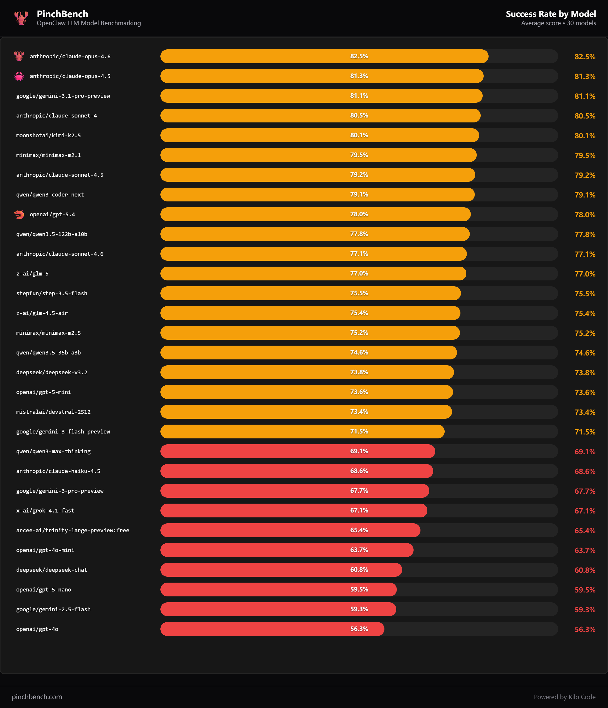
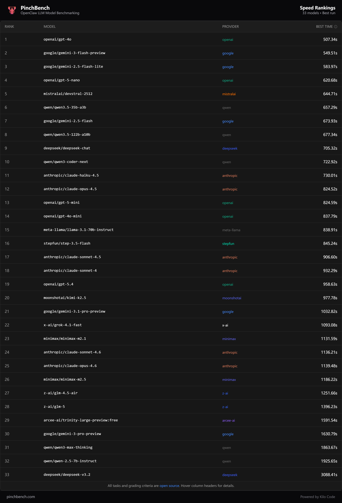
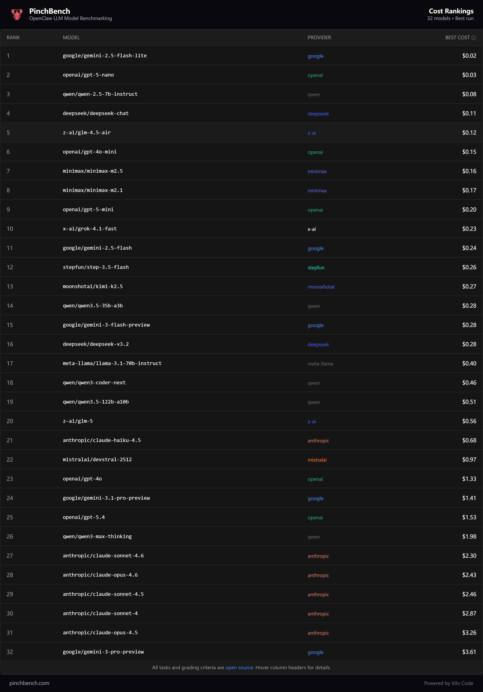
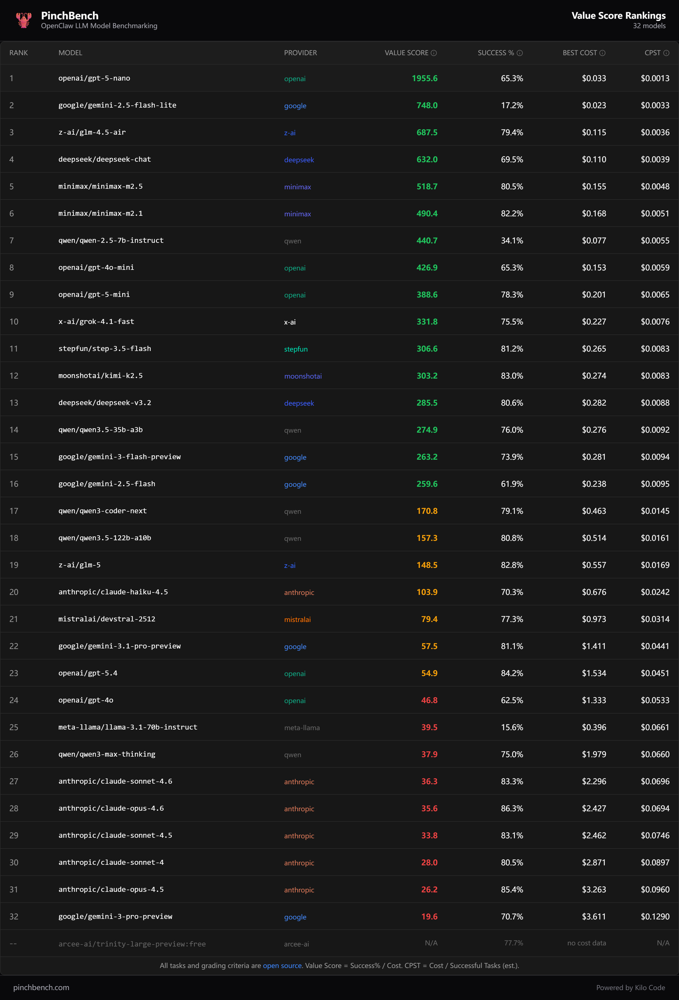

大家好，我是算法工程笔记。

周一了，聊点实际的。最近不少朋友在折腾 OpenClaw（龙虾），想找个合适的大模型来跑，但面对一堆模型，到底选哪个？

今天这篇主要聊聊 [PinchBench](https://pinchbench.com/) 这个平台给出的评测数据，帮大家快速选型。

## PinchBench 评了什么？

PinchBench 做的事情很直接：拿各个大模型跑 OpenClaw，然后从四个方面打分：

* **任务成功率**：一系列预定义任务，模型能不能完成
* **响应速度**：跑得快不快
* **成本**：跑一次花多少钱
* **性价比**：成功率除以单次成本，看谁更值

## 评测结果（2026.03.10）

直接上图。

### 任务成功率

### 响应速度

### 成本

### 性价比

## 几个有意思的发现

数据里有几个点挺反直觉的：

* MiniMax-M2.1 的成功率比 M2.5 高。老版本干活比新版本靠谱，升级不等于全面提升，大模型圈经常出现这种情况。
* GPT-5.4 排在了几个国产模型后面。**Kimi-K2.5**、MiniMax-M2.1、Qwen3-Coder-Next 的成功率都比它高，OpenAI 在 Coding Agent 场景上没那么能打。
* 性价比榜单有点意外，GLM-4.5-Air 和 MiniMax-M2.5 排在前列，便宜够用，跑量场景下很香。

## 选型建议

**国内跑 OpenClaw**，推荐 **Kimi-K2.5** 或 **MiniMax-M2.1/M2.5**，成功率和性价比都在第一梯队。

**想省钱试水**，两个路子：
* 用 API 提供商（比如[硅基流动](https://cloud.siliconflow.cn/i/yU5sBpoP)）提供的免费 API
* 或者参考 [不用部署、不用显卡，Nvidia 官方喊你来"白嫖"最新开源模型](https://mp.weixin.qq.com/s/nTxdQTKkhvuzzxpyZZhOow)，用 NIM 平台的免费 API

选模型别光看名气，多看实测数据，少踩坑。

---

感谢阅读，如果这篇内容对你有启发，欢迎点赞、转发和关注支持。
